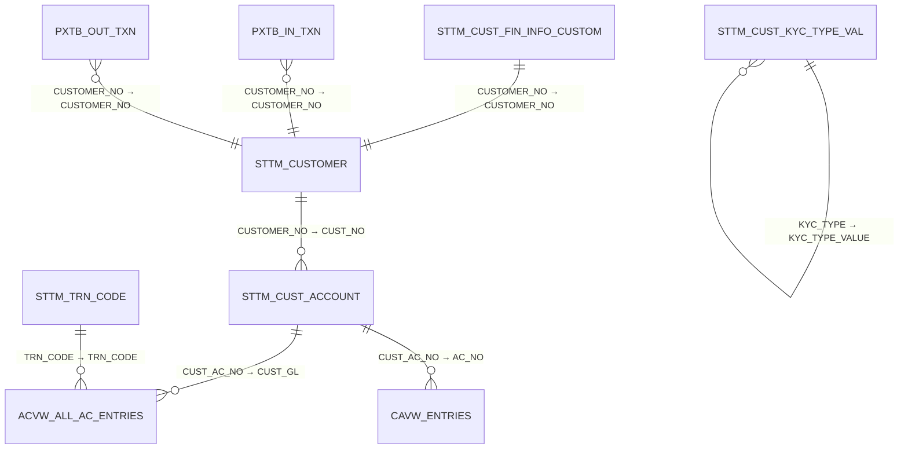

# AML/FCUBS Database Documentation

> **Generated**: 2025-10-10 18:11
> **Source**: AML/FCUBS SQL Reports Analysis

---

## 📊 Overview

- **Total Tables**: 21
- **Total Fields**: 162
- **Total Reports**: 6
- **Identified Relationships**: 8

---

## 📑 Table of Contents

1. [ACVW_ALL_AC_ENTRIES](#acvw-all-ac-entries)
2. [AETM_EOC_GROUP_BRANCHES](#aetm-eoc-group-branches)
3. [CAVW_ENTRIES](#cavw-entries)
4. [EIVW_PENDING_ITEMS_GBK](#eivw-pending-items-gbk)
5. [PMTB_ACC_ENTRY_QUEUE_DETAILS](#pmtb-acc-entry-queue-details)
6. [PMTB_MSG_DLY_MSG_IN](#pmtb-msg-dly-msg-in)
7. [PQTB_ACC_ENTRY_QUEUE](#pqtb-acc-entry-queue)
8. [PQTB_STP_QUEUE](#pqtb-stp-queue)
9. [PXTB_IN_TXN](#pxtb-in-txn)
10. [PXTB_IN_TXN_DRIVER](#pxtb-in-txn-driver)
11. [PXTB_OUT_TXN](#pxtb-out-txn)
12. [PXTB_OUT_TXN_DRIVER](#pxtb-out-txn-driver)
13. [STTM_CUSTOMER](#sttm-customer)
14. [STTM_CUST_ACCOUNT](#sttm-cust-account)
15. [STTM_CUST_FIN_INFO_CUSTOM](#sttm-cust-fin-info-custom)
16. [STTM_CUST_KYC_TYPE_VAL](#sttm-cust-kyc-type-val)
17. [STTM_KYC_OTHER_TYPES](#sttm-kyc-other-types)
18. [STTM_STATIC_TYPE](#sttm-static-type)
19. [STTM_TRN_CODE](#sttm-trn-code)
20. [sttm_cust_account](#sttm-cust-account)
21. [sttm_customer](#sttm-customer)

---

## 🔗 Entity Relationships

### Key Relationships

### Relationship Details

| From Table | From Field | To Table | To Field | Type | Description |
|------------|------------|----------|----------|------|-------------|
| STTM_CUSTOMER | CUSTOMER_NO | STTM_CUST_ACCOUNT | CUST_NO | One-to-Many | A customer can have multiple accounts. |
| STTM_CUST_ACCOUNT | CUST_AC_NO | ACVW_ALL_AC_ENTRIES | CUST_GL | One-to-Many | An account can have multiple entries. |
| STTM_CUST_ACCOUNT | CUST_AC_NO | CAVW_ENTRIES | AC_NO | One-to-Many | An account can have multiple transaction entries. |
| STTM_TRN_CODE | TRN_CODE | ACVW_ALL_AC_ENTRIES | TRN_CODE | One-to-Many | A transaction code can be associated with multiple entries. |
| STTM_CUST_FIN_INFO_CUSTOM | CUSTOMER_NO | STTM_CUSTOMER | CUSTOMER_NO | One-to-One | Each customer has a unique financial information record. |
| STTM_CUST_KYC_TYPE_VAL | KYC_TYPE | STTM_CUST_KYC_TYPE_VAL | KYC_TYPE_VALUE | One-to-Many | A KYC type can have multiple values. |
| PXTB_IN_TXN | CUSTOMER_NO | STTM_CUSTOMER | CUSTOMER_NO | Many-to-One | Multiple transactions can belong to a single customer. |
| PXTB_OUT_TXN | CUSTOMER_NO | STTM_CUSTOMER | CUSTOMER_NO | Many-to-One | Multiple transactions can belong to a single customer. |

---

## 📚 Table Catalog

### ACVW_ALL_AC_ENTRIES

**Fields**: 11 | **Used in**: 3 report(s) | **Connection**: FCUBS_Reporting

**Primary Key**: `AC_NO`

#### Fields

| Field Name | Type | Notes |
|------------|------|-------|
| `AC_NO` | 🔑 PK | Primary Key |
| `BALANCE_UPD` |  |  |
| `CUST_GL` |  |  |
| `DRCR_IND` |  |  |
| `EVENT` |  |  |
| `EXTERNAL_REF_NO` |  |  |
| `IB` |  |  |
| `LCY_AMOUNT` |  |  |
| `TRN_CODE` |  |  |
| `TRN_DT` |  |  |
| `TRN_REF_NO` |  |  |

#### Used In Reports

- CBK Cash Deposits
- CBK Selfpay and WAMD Transactions
- CBK Total Credit Transactions

---

### AETM_EOC_GROUP_BRANCHES

**Fields**: 2 | **Used in**: 1 report(s) | **Connection**: FCUBSConn_Mirror

#### Fields

| Field Name | Type | Notes |
|------------|------|-------|
| `BRANCH_CODE` |  |  |
| `GROUP_CODE` |  |  |

#### Used In Reports

- EOD Pending Items

---

### CAVW_ENTRIES

**Fields**: 6 | **Used in**: 1 report(s) | **Connection**: FCUBS_Reporting

#### Fields

| Field Name | Type | Notes |
|------------|------|-------|
| `AC_NO` |  |  |
| `DRCR_IND` |  |  |
| `LCY_AMOUNT` |  |  |
| `TRN_DT` |  |  |
| `TRN_REF_NO` |  |  |
| `TXN_NARRATIVE` |  |  |

#### Used In Reports

- CBK Selfpay and WAMD Transactions

---

### EIVW_PENDING_ITEMS_GBK

**Fields**: 1 | **Used in**: 1 report(s) | **Connection**: FCUBSConn_Mirror

#### Fields

| Field Name | Type | Notes |
|------------|------|-------|
| `BRANCH` |  |  |

#### Used In Reports

- EOD Pending Items

---

### PMTB_ACC_ENTRY_QUEUE_DETAILS

**Fields**: 2 | **Used in**: 1 report(s) | **Connection**: FCUBS_Reporting

#### Fields

| Field Name | Type | Notes |
|------------|------|-------|
| `HANDOFF_STATUS` |  |  |
| `TXN_REF_NO` |  |  |

#### Used In Reports

- Incoming Payments

---

### PMTB_MSG_DLY_MSG_IN

**Fields**: 11 | **Used in**: 1 report(s) | **Connection**: FCUBS_Reporting

#### Fields

| Field Name | Type | Notes |
|------------|------|-------|
| `AMOUNT` |  |  |
| `CCY` |  |  |
| `GENERATED_REF_NO` |  |  |
| `MSG_STATUS` |  |  |
| `NETWORK_CODE` |  |  |
| `PROCESS_STATUS` |  |  |
| `RECEIVE_DT_STAMP` |  |  |
| `REFERENCE_NO` |  |  |
| `SENDER` |  |  |
| `SWIFT_MSG_TYPE` |  |  |
| `VALUE_DATE` |  |  |

#### Used In Reports

- Incoming Payments

---

### PQTB_ACC_ENTRY_QUEUE

**Fields**: 2 | **Used in**: 1 report(s) | **Connection**: FCUBS_Reporting

#### Fields

| Field Name | Type | Notes |
|------------|------|-------|
| `ERR_DESC` |  |  |
| `TXN_REF_NO` |  |  |

#### Used In Reports

- Incoming Payments

---

### PQTB_STP_QUEUE

**Fields**: 3 | **Used in**: 1 report(s) | **Connection**: FCUBS_Reporting

#### Fields

| Field Name | Type | Notes |
|------------|------|-------|
| `AUTH_STAT` |  |  |
| `CURRENT_STATUS` |  |  |
| `TXN_REF_NO` |  |  |

#### Used In Reports

- Incoming Payments

---

### PXTB_IN_TXN

**Fields**: 46 | **Used in**: 1 report(s) | **Connection**: FCUBS_Reporting

**Primary Key**: `EXTERNAL_REF_NO`

#### Fields

| Field Name | Type | Notes |
|------------|------|-------|
| `ACC_WITH_INST2_CODE` |  |  |
| `BENEFICIARY1` |  |  |
| `BENEFICIARY2` |  |  |
| `BENEFICIARY3` |  |  |
| `BENEFICIARY4` |  |  |
| `BENEFICIARY5` |  |  |
| `CHARGE_WHOM` |  |  |
| `CR_AC_CCY` |  |  |
| `CR_AC_NO` |  |  |
| `CR_AMOUNT` |  |  |
| `CUSTOMER_NO` | 🔗 FK | → STTM_CUSTOMER.CUSTOMER_NO |
| `DR_AC_BRN` |  |  |
| `DR_AC_CCY` |  |  |
| `DR_AC_NO` |  |  |
| `DR_AMOUNT` |  |  |
| `EXTERNAL_REF_NO` | 🔑 PK | Primary Key |
| `FILE_REF_NO` |  |  |
| `INSTRUCTION_DATE` |  |  |
| `INTERMEDIARY2_CODE` |  |  |
| `LCY_EQUIVALENT` |  |  |
| `NETWORK` |  |  |
| `ORDERING_CUSTOMER1` |  |  |
| `ORDERING_CUSTOMER2` |  |  |
| `ORDERING_CUSTOMER3` |  |  |
| `ORG_INSTRUCTION_DATE` |  |  |
| `PAYMENT_DETAILS1` |  |  |
| `PAYMENT_DETAILS2` |  |  |
| `PAYMENT_DETAILS3` |  |  |
| `PAYMENT_DETAILS4` |  |  |
| `PAYMENT_TYPE` |  |  |
| `RECEIVED_DATE_TIME` |  |  |
| `RECEIVER` |  |  |
| `REGULATORY_DETAILS1` |  |  |
| `REGULATORY_DETAILS2` |  |  |
| `REGULATORY_DETAILS3` |  |  |
| `SNDR_TO_RCVR_INFO1` |  |  |
| `SNDR_TO_RCVR_INFO2` |  |  |
| `SNDR_TO_RCVR_INFO3` |  |  |
| `SNDR_TO_RCVR_INFO4` |  |  |
| `SNDR_TO_RCVR_INFO5` |  |  |
| `SNDR_TO_RCVR_INFO6` |  |  |
| `SOURCE_CODE` |  |  |
| `TRANSFER_TYPE` |  |  |
| `TXN_AMOUNT` |  |  |
| `TXN_CCY` |  |  |
| `TXN_REF_NO` |  |  |

#### Used In Reports

- Incoming Payments

---

### PXTB_IN_TXN_DRIVER

**Fields**: 3 | **Used in**: 1 report(s) | **Connection**: FCUBS_Reporting

#### Fields

| Field Name | Type | Notes |
|------------|------|-------|
| `QUEUE_CODE` |  |  |
| `TXN_REF_NO` |  |  |
| `TXN_STATUS` |  |  |

#### Used In Reports

- Incoming Payments

---

### PXTB_OUT_TXN

**Fields**: 46 | **Used in**: 1 report(s) | **Connection**: FCUBS_Reporting

**Primary Key**: `EXTERNAL_REF_NO`

#### Fields

| Field Name | Type | Notes |
|------------|------|-------|
| `ACC_WITH_INST2_CODE` |  |  |
| `BENEFICIARY1` |  |  |
| `BENEFICIARY2` |  |  |
| `BENEFICIARY3` |  |  |
| `BENEFICIARY4` |  |  |
| `BENEFICIARY5` |  |  |
| `CHARGE_WHOM` |  |  |
| `CR_AC_CCY` |  |  |
| `CR_AC_NO` |  |  |
| `CR_AMOUNT` |  |  |
| `CUSTOMER_NO` | 🔗 FK | → STTM_CUSTOMER.CUSTOMER_NO |
| `DR_AC_BRN` |  |  |
| `DR_AC_CCY` |  |  |
| `DR_AC_NO` |  |  |
| `DR_AMOUNT` |  |  |
| `EXTERNAL_REF_NO` | 🔑 PK | Primary Key |
| `FILE_REF_NO` |  |  |
| `INSTRUCTION_DATE` |  |  |
| `INTERMEDIARY2_CODE` |  |  |
| `LCY_EQUIVALENT` |  |  |
| `NETWORK` |  |  |
| `ORDERING_CUSTOMER1` |  |  |
| `ORDERING_CUSTOMER2` |  |  |
| `ORDERING_CUSTOMER3` |  |  |
| `ORG_INSTRUCTION_DATE` |  |  |
| `PAYMENT_DETAILS1` |  |  |
| `PAYMENT_DETAILS2` |  |  |
| `PAYMENT_DETAILS3` |  |  |
| `PAYMENT_DETAILS4` |  |  |
| `PAYMENT_TYPE` |  |  |
| `RECEIVED_DATE_TIME` |  |  |
| `RECEIVER` |  |  |
| `REGULATORY_DETAILS1` |  |  |
| `REGULATORY_DETAILS2` |  |  |
| `REGULATORY_DETAILS3` |  |  |
| `SNDR_TO_RCVR_INFO1` |  |  |
| `SNDR_TO_RCVR_INFO2` |  |  |
| `SNDR_TO_RCVR_INFO3` |  |  |
| `SNDR_TO_RCVR_INFO4` |  |  |
| `SNDR_TO_RCVR_INFO5` |  |  |
| `SNDR_TO_RCVR_INFO6` |  |  |
| `SOURCE_CODE` |  |  |
| `TRANSFER_TYPE` |  |  |
| `TXN_AMOUNT` |  |  |
| `TXN_CCY` |  |  |
| `TXN_REF_NO` |  |  |

#### Used In Reports

- Incoming Payments

---

### PXTB_OUT_TXN_DRIVER

**Fields**: 3 | **Used in**: 1 report(s) | **Connection**: FCUBS_Reporting

#### Fields

| Field Name | Type | Notes |
|------------|------|-------|
| `QUEUE_CODE` |  |  |
| `TXN_REF_NO` |  |  |
| `TXN_STATUS` |  |  |

#### Used In Reports

- Incoming Payments

---

### STTM_CUSTOMER

**Fields**: 6 | **Used in**: 3 report(s) | **Connection**: FCUBS_Reporting

**Primary Key**: `CUSTOMER_NO`

#### Fields

| Field Name | Type | Notes |
|------------|------|-------|
| `CUSTOMER_NAME1` |  |  |
| `CUSTOMER_NO` | 🔗 FK | → STTM_CUST_ACCOUNT.CUST_NO |
| `CUSTOMER_TYPE` |  |  |
| `FULL_NAME` |  |  |
| `KYC_REF_NO` |  |  |
| `STAFF` |  |  |

#### Used In Reports

- CBK Cash Deposits
- CBK Selfpay and WAMD Transactions
- CBK Total Credit Transactions

---

### STTM_CUST_ACCOUNT

**Fields**: 2 | **Used in**: 3 report(s) | **Connection**: FCUBS_Reporting

**Primary Key**: `CUST_AC_NO`

#### Fields

| Field Name | Type | Notes |
|------------|------|-------|
| `CUST_AC_NO` | 🔗 FK | → ACVW_ALL_AC_ENTRIES.CUST_GL |
| `CUST_NO` |  |  |

#### Used In Reports

- CBK Cash Deposits
- CBK Selfpay and WAMD Transactions
- CBK Total Credit Transactions

---

### STTM_CUST_FIN_INFO_CUSTOM

**Fields**: 2 | **Used in**: 1 report(s) | **Connection**: FCUBS_Reporting

**Primary Key**: `CUSTOMER_NO`

#### Fields

| Field Name | Type | Notes |
|------------|------|-------|
| `CUSTOMER_NO` | 🔗 FK | → STTM_CUSTOMER.CUSTOMER_NO |
| `PROFESSION` |  |  |

#### Used In Reports

- CBK Selfpay and WAMD Transactions

---

### STTM_CUST_KYC_TYPE_VAL

**Fields**: 3 | **Used in**: 1 report(s) | **Connection**: FCUBS_Reporting

**Primary Key**: `KYC_TYPE`

#### Fields

| Field Name | Type | Notes |
|------------|------|-------|
| `KYC_TYPE` | 🔗 FK | → STTM_CUST_KYC_TYPE_VAL.KYC_TYPE_VALUE |
| `KYC_TYPE_VALUE` |  |  |
| `KYC_TYPE_VALUE_DESC` |  |  |

#### Used In Reports

- CBK Selfpay and WAMD Transactions

---

### STTM_KYC_OTHER_TYPES

**Fields**: 2 | **Used in**: 1 report(s) | **Connection**: FCUBS_Reporting

#### Fields

| Field Name | Type | Notes |
|------------|------|-------|
| `KYC_REFERENCE_NO` |  |  |
| `OCCUPATION` |  |  |

#### Used In Reports

- CBK Selfpay and WAMD Transactions

---

### STTM_STATIC_TYPE

**Fields**: 4 | **Used in**: 1 report(s) | **Connection**: FCUBS_Reporting

#### Fields

| Field Name | Type | Notes |
|------------|------|-------|
| `RECORD_STAT` |  |  |
| `TYPE` |  |  |
| `TYPE_NAME` |  |  |
| `TYPE_VALUE` |  |  |

#### Used In Reports

- CBK Selfpay and WAMD Transactions

---

### STTM_TRN_CODE

**Fields**: 2 | **Used in**: 1 report(s) | **Connection**: FCUBS_Reporting

**Primary Key**: `TRN_CODE`

#### Fields

| Field Name | Type | Notes |
|------------|------|-------|
| `TRN_CODE` | 🔗 FK | → ACVW_ALL_AC_ENTRIES.TRN_CODE |
| `TRN_DESC` |  |  |

#### Used In Reports

- CBK Cash Deposits

---

### sttm_cust_account

**Fields**: 2 | **Used in**: 1 report(s) | **Connection**: FCUBS_Reporting

#### Fields

| Field Name | Type | Notes |
|------------|------|-------|
| `AC_DESC` |  |  |
| `CUST_AC_NO` |  |  |

#### Used In Reports

- Incoming Payments

---

### sttm_customer

**Fields**: 3 | **Used in**: 1 report(s) | **Connection**: FCUBS_Reporting

#### Fields

| Field Name | Type | Notes |
|------------|------|-------|
| `CUSTOMER_CATEGORY` |  |  |
| `CUSTOMER_NAME1` |  |  |
| `CUSTOMER_NO` |  |  |

#### Used In Reports

- Incoming Payments

---

## 📊 Reports Overview

| # | Report Name | Tables Used | Description |
|---|-------------|-------------|-------------|
| 1 | CBK Cash Deposits | 4 | This SQL query retrieves and aggregates cash deposit transactions from a financial database. It focu... |
| 2 | CBK Selfpay and WAMD Transactions | 8 | This SQL query aggregates transaction data from two main tables, `FCUBS145.CAVW_ENTRIES` and `FCUBS1... |
| 3 | CBK Total Credit Transactions | 3 | This SQL query retrieves and aggregates credit transaction data from a financial database. It focuse... |
| 4 | EOD Pending Items | 2 | This SQL query retrieves all records from the `fcubs145.EIVW_PENDING_ITEMS_GBK` table where the `BRA... |
| 5 | Incoming Payments | 10 | This SQL query retrieves and processes transaction data from multiple tables within the FCUBS145 sch... |
| 6 | List of Guarantees Due for Cancellation | 12 | This SQL query retrieves a list of active contracts from a financial database, focusing on guarantee... |

---

*Generated by Smart Documentation Generator*
